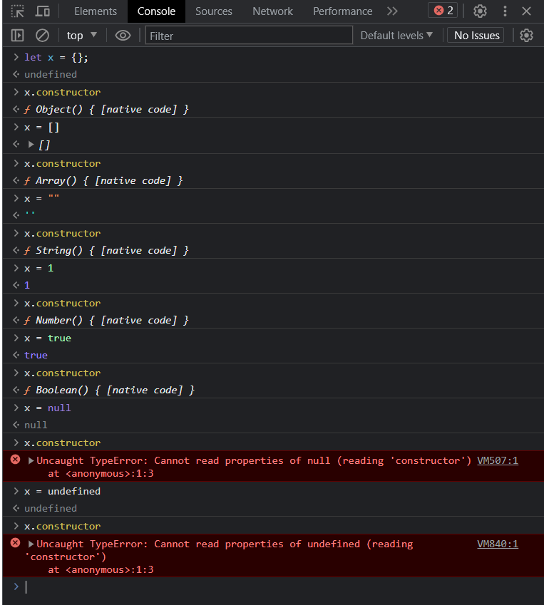
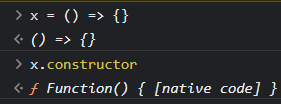

# oop-javascript

Programação orientada a objetos em JavaScript

## Functions vs Objects

### Here we have the same logic written in diferent ways

- Functional Programming

```js
let baseSalary = 30_000;
let overtime = 10;
let rate = 20;

function getWage(baseSalary, overtime, rate) {
  return baseSalary + overtime * rate;
}

console.log(getWage(baseSalary, overtime, rate));
```

- Object Oriented Programming

```js
let employee = {
baseSalary: 30_000,
overtime: 10,
rate: 20,

getWage: function () {
return this.baseSalary + this.overtime \* this.rate;
},
};

console.log(employee.getWage());
```

## Literal, Factory and Constructor

### We have three ways to create an object:

- Object literal sintax

```js
const literalCircle = {
  radious: 1,
  draw: function () {
    console.log("drawing circle");
  },
};
```

- Factory function

```js
function createCircle(radious) {
  return {
    radious,
    draw: function () {
      console.log("drawing circle");
    },
  };
}
const factoryCircle = createCircle(1);
```

- Constructor function (capital letter convention)

```js
function Circle(radious) {
  this.radious = radious;
  this.draw = function () {
    console.log("drawing circle");
  };
}
const constructorCircle = new Circle(1);
```

## new Operator

### why using `new Circle(1)` insted of `Circle(1)`?

By defaul, `this` refers to the global object. So declaring properties like:

```js
this.radious = radious;
this.draw = function () {};
```

Will change the global object.

So to solve this we can call the new operator which does three things:

```js
const constructorCircle = new Circle(1);
```

- First it will create an new empty object. `{}`
- Then it will set `this` to point to this new object.
- Finally it will return this object from the function so you dont _explicity_ return nothing.

## Constructure property

Every javascript object has an constructure property that refences the function used to create that object.
Notice that almost every javascript types are objects generated by internal native constructors.



but insted of calling new String, new Number, new Object and so on, we can use the literals syntax such as:

- String literals

```js
x = "";
```

instead of

- String constructure function

```js
x = new String();
```

And that's why javascript types comes with pre builded methods and proprieties like : `.toString()`, `.toLowerCase()`, `.length` and so on.

## Functions are Objects

As the exemples above, functions are also objects and reveice methods and proprieties like `.call()`, `.bind()`, `.name` and others.


